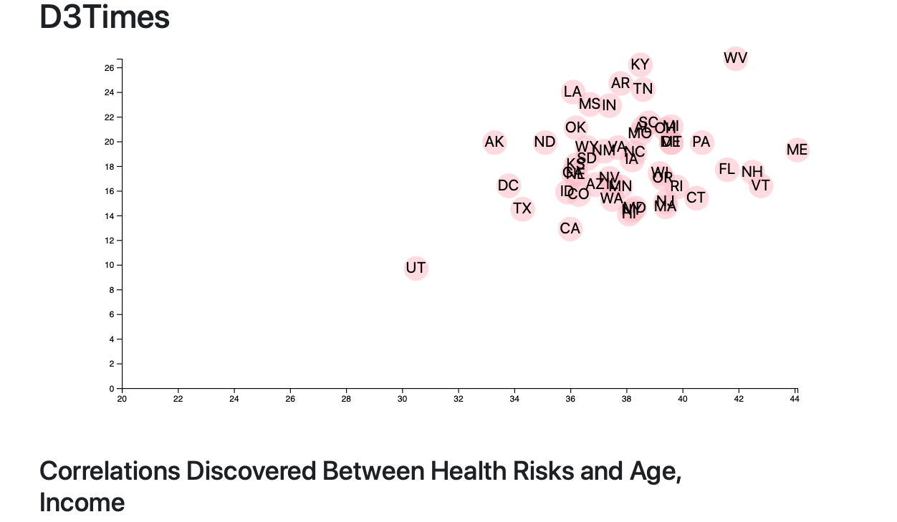

# DataJournalismD3

Uses a csv from https://factfinder.census.gov/faces/nav/jsf/pages/searchresults.xhtml to find correlations between 
health risks and income based on state. the chart is made with D3

